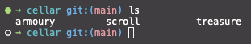
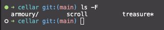
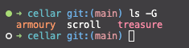
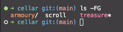

# Using the Terminal

This exercise is designed to help you learn to navigate and manipulate the file system of your computer
by simulating a `Choose Your Own Adventure` style game.

## Learning objectives

After completing this exercise, you'll understand how to:

* Navigate a folder stucture in the terminal.
* Read the contents of a text file in the terminal.
* Create, copy, move and delete files and folders.

## Evaluation criteria and functional requirements

* The `bashcrawl` project folder structure should be modified to show the `game` instructtions were followed.
    * Hidden files and folders have been made visible.
    * Appropriate files have been created or copied.
* All changes have been committed and pushed to the repository.

## Getting started

1. Open `terminal` and navigate to the `bashcrawl/entrance` directory.
2. Use terminal commands to explore the folders and files.
    * Explore all folders.
    * Use the `cat` command to read the `scrolls` in each folder and follow the instructions.
    * Execute any shell scripts and follow the instructions.
3. Explore.
4. Push your work.

## Tips and tricks

### Configure your shell

The terminal does not differentiate between files and folders by default when you execute the `ls` command. In other words, it just displays a list of contents, but you cannot tell visually whether each item is a `folder`, a `plain text` file, or a `shell script`.

For instance, it is not possible to determine visually what type each of the following items are.



Executing `ls -F` indicates file/folder types textually:
* `armoury/` is a folder
* `scroll` is a plain text file
* `treasure*` is a shell script file



`ls -G` differentiates file types by color.



You can combine both by executing `ls -F -G` or `ls -FG`



Create an alias for the `ls` command so that you don't need to include the flags.

```bash
alias ls='ls -FG'
```
Now every time you execute `ls` it will show file/folder types and add color.

### Tips and Tricks

Shell scripts are mini applications. You must execute the shell scripts from
the terminal. Here are 2 options.

#### Option 1
```bash
# prefix the shell file name with ./
./shell-file-name
```
#### Option 2
``` bash
# explicityly execute the file as a shell script
sh shell-file-name
```


## Submitting Your Work

When you have completed the exercise, you need to push your changes to your repository.

This is done in 3 steps.

```bash
# 1. Stage all changes in the repository
git add -A

# 2. Commit your changes (commits MUST have a message)
git commit -m "completed castle discovery"

# 3. Push your committed work
git push
# or
git push origin main
```