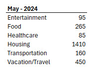
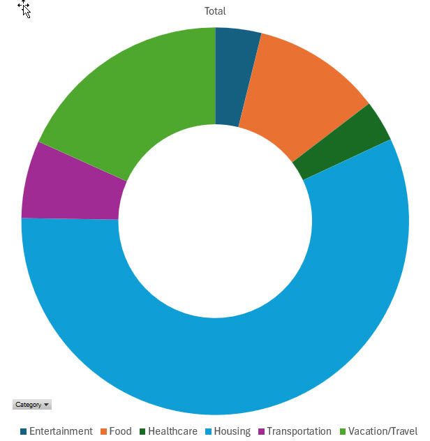
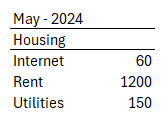
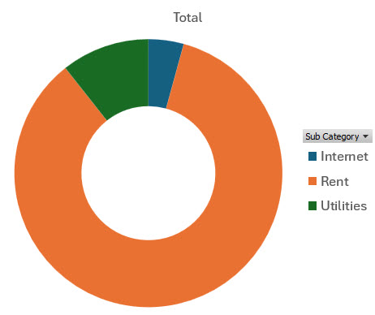
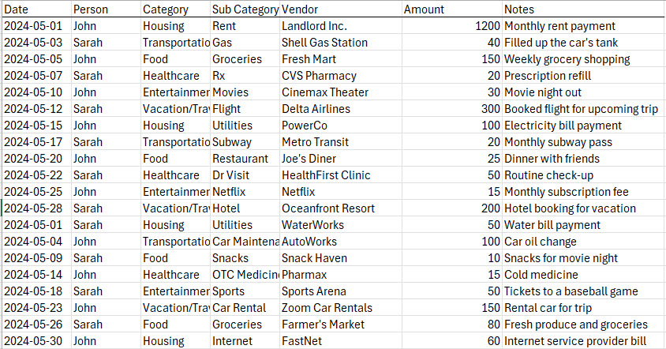

# Database Design

Design a database to manage your personal budget.

## Requirements

The database should be able to handle all financial transactions and allow you to create the following reports.

### All categories - by month




### Housing expenses - by Month




### Sample data set

Following is a sample dataset of transactions that you will need to store in your database. Although this is a simple spreadsheet, as you design your database consider how you might design a database with multiple tables.



## Scripts

Develop a script that will create the database and all appropriate tables needed for this project. You should also add scripts to populate the tables with sample values (you can use ChatGPT to help generate sample data to add to your scripts).

```sql
CREATE TABLE transactions
(
    -- add columns here
)
```
