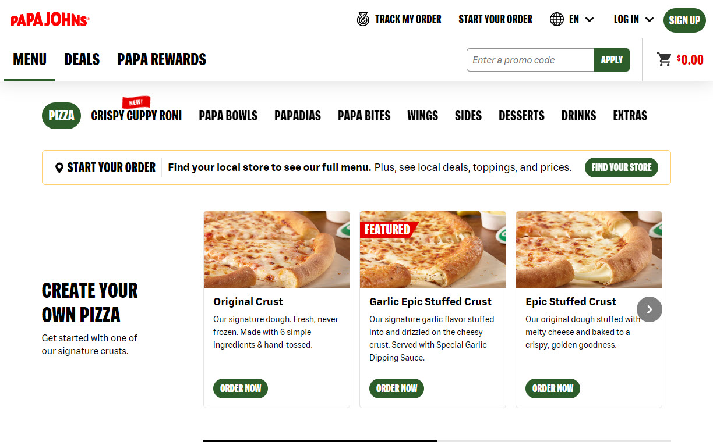
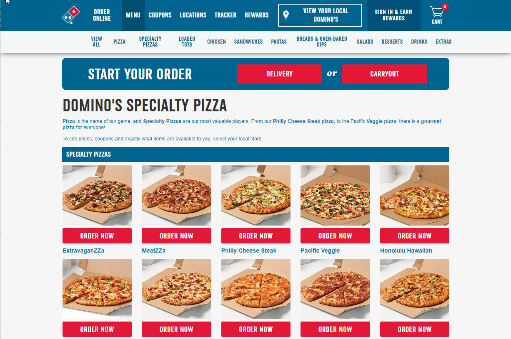

# Pizza Shop Website Project
This is a multi-day project. You will begin setting up the pages after the intro to HTML and CSS discussions, and you will continue working on the project after learning about CSS FlexBox, CSS Grid and bootstrap.

## Project Overview
Create a 3-page website emulating the layout and style of a provided example. This project will help you practice basic HTML structure, adding images, tables, and semantic HTML elements, as well as using CSS for formatting.

Your website must be responsive. The layout should change appropriately with according to screen sizes (phone, tablet, laptop).

## Example Website
For this exercise, we'll create a simple pizza shop website. Here’s a description of the layout to emulate:

### Home Page (index.html)
- **Header**: Contains the pizza shop name and a navigation menu with links to other pages.
- **Main Content**: 
  - Introduction section with a heading and a paragraph welcoming customers.
  - A list of signature pizzas (e.g., Cheese, Pepperoni, Hawaiian, Supreme, Veggie) with images.
- **Footer**: Contains contact information and social media links.

### Details Page (details.html)
- **Header**: Same as the home page.
- **Main Content**:
  - A heading with the pizza name.
  - An image of the pizza.
  - A table displaying the pizza details, including price and toppings. (include images of the toppings)
- **Footer**: Same as the home page.

### Checkout Page (checkout.html)
- **Header**: Same as the home page.
- **Main Content**:
  - A heading with "Checkout".
  - A form with fields for customer name, address, and payment information.
  - A dropdown menu with a list of available pizzas.
- **Footer**: Same as the home page.

## HTML Requirements
- Use semantic HTML elements: `<header>`, `<nav>`, `<main>`, `<section>`, `<footer>`, `<table>`, `<form>`.
- Include at least one image on each page.
- Create a table on the details page listing pizza details.
- Create a form on the checkout page with appropriate input fields.

## CSS Requirements

- Style the header, navigation menu, main content, and footer using CSS.
- Use CSS to style the table and form elements.
- Apply different background colors or images to the header and footer.
- Use margins and padding to space out elements.

## Example Website Screenshot

Look online at some of your favorite pizza websites for some design ideas:

[Papa John's Pizza]("https://papajohns.com")

[Domino's Pizza]("https://dominos.com")

## Additional Notes

- Ensure the navigation links work and lead to the correct pages.
- Use placeholder text and images where necessary.
- The look and feel of the website should be consistent between the pages

## Submission

- Commit and push your changes to your repository.
- Ensure the website displays correctly in a web browser.
