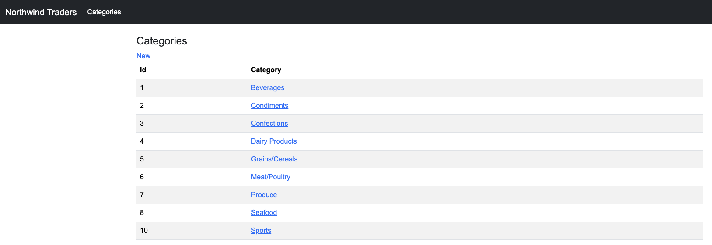
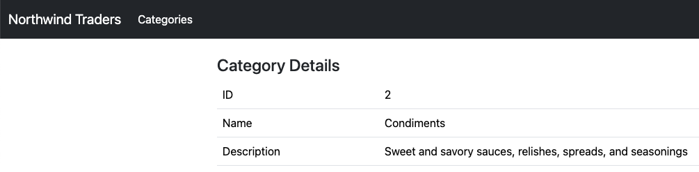
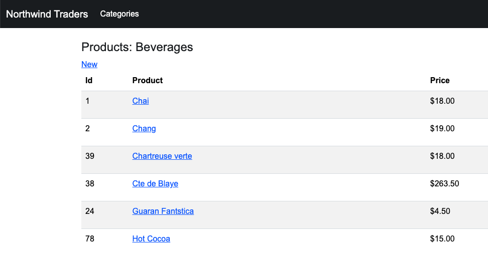
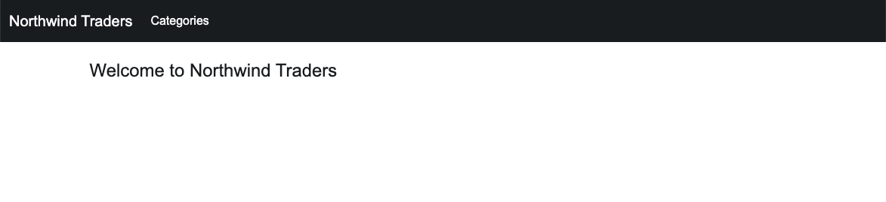

# Spring Boot with Thymeleaf Exercise - Part 1

In this chapter you learned how to build Spring Boot web applications
using the MVC pattern.

In these exercise you will solidify these concepts by creating Spring 
controllers and using the Thymeleaf view engine to build your views. 

## Learning objectives

After completing this exercise, you'll understand:

* How the MVC pattern is used in web application development
* How to create Spring 
* How to respond to GET requests
* How to build view templates using the Thymeleaf syntax
* How to create a collections/list page
* How to create a detail page


## Evaluation criteria and functional requirements

* The project must compile (it cannot have any build errors).
* Your project must have a categories list page
* Your project must have a category details page
* **Optional** Your project should have a products by category list page
* **Optional** Your project should have a product detail page 

## Getting started

1. Open the `exercises_mvc-web-appliclation` project in IntelliJ.
2. Expand the `controllers` package and open the `CategoryController`.
3. Add an `@GetMapping()` method to handle the `/categories` path
    - Use a CategoryDao object to get all categories and add them to the `model`
    - Return `categories/index` as the name of the view to be processed
4. Modify the `categories/index.html` file in the `resources/templates/categories` 
   folder to use Thymeleaf syntax and to display the list of categories in a table
    - Use an `<a href="">` tag to link to a category details page
        - Use Thymeleaf syntax for `<a th:href="">` (see hints below)
    - The details page link should follow this pattern `http://localhost:8080/categories/1` where 
      `1` is the id of the category
      
5. In the Categories controller, add a `@GetMapping("/categories/{id}")` to handle the request for a category
    detail page.
    - The relative path of the page will be `/categories/1` where `1` is the id of the category
    - Ensure that your method uses the `@PathVariable` annotation to accept the `id` as an input parameter
    - Use the `CategoryDao` object to get the category by Id
    - Add the category to the Spring Boot `model`
    - Return the name of the view details template: `categories\details`
6. Create a new view template for the details view in the `templates\categories` folder.
    - File name `details.html`
    - Add the HTML and Thymeleaf syntax to display the category details on the page
    

## Optional / Challenge

Add functionality to the `ProductsController` to display lists of products and to display product details.

1. Update the category list view template (`categories/index`) to include a link to display all
   products in a category. 
    - The link should navigate to `http://localhost:8080/products/1` where `1` is the id of the selected category

2. Add an `@GetMapping()` method to handle the `/products?catId=1` path
    - Use the ProductDao object to get all products by categoryId
        - add the `products` them to the `model`
    - You will also need a CategoryDao object to get the category by Id
        - Add the `category` object to the `model` as well
    - Return `products/index` as the name of the view to be processed
4. Create a new view template file at `products/index.html` file in the
   and use Thymeleaf syntax and to display the list of products in a table
    - Display the `Category Name` at the top of the page in a header
    - Use a table to display the list of products in the selected category
    - Use an `<a href="">` tag to link to a product details page
        - Use Thymeleaf syntax for `<a th:href="">` (see hints below)
    - The details page link should follow this pattern `http://localhost:8080/products/1` where 
      `1` is the id of the product
    - Display the price of the product using currency formatting `$18.00` etc (see hints below)
    
5. In the Products controller, add a `@GetMapping("/products/{id}")` to handle the request for a products
    detail page.
    - The relative path of the page will be `/products/1` where `1` is the id of the product
    - Ensure that your method uses the `@PathVariable` annotation to accept the `id` as an input parameter
    - Use the `ProductDao` object to get the product by Id
        - Add the product to the Spring Boot `model`
    - Use the `CategoryDao` object to the the category associated with the products categoryId
        - Add the category to the Spring Boot `model`
    - Return the name of the view details template: `products/details`
6. Create a new view template for the details view in the `templates/products` folder.
    - File name `details.html`
    - Add the HTML and Thymeleaf syntax to display the product details on the page
    - Display the category name of the product instead of just the category id
    
7. Create a `HomeController` to handle a home page for the website
    - The HomeController should have only one `@GetMapping("/")` handler method
    - There should be no Dao used for this controller
    - The home page handler should return `index` as the name of the view template to render
8. Create a new view template for the home page 
    - Add a new file `index.html` to the `resources/templates` folder
    - Add HTMl and CSS to create a simple home welcome page for the website
    

## Tips and hints

Thymeleaf syntax hints

```html
<!-- for loop - creates a "category" variable for each item in the "categories" ArrayList-->
<tr th:each="category:${categories}"> ... </tr>


<!-- display category name -->
<td th:text="${category.categoryName}"></td>

<!-- create a link using category id -->
<td><a th:href="@{|/categories/${category.categoryId}|}" th:text="..."></a></td>

<!-- OPTIONAL formatting product price with currency -->
<td th:text="${#numbers.formatCurrency(product.unitPrice)}"></td>

```


