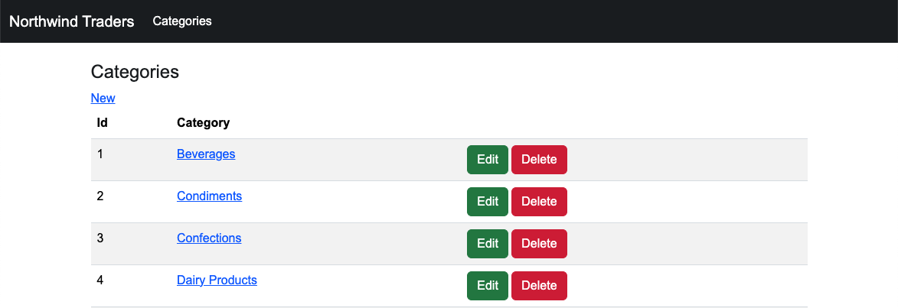
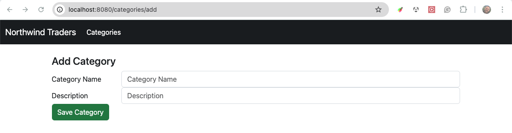
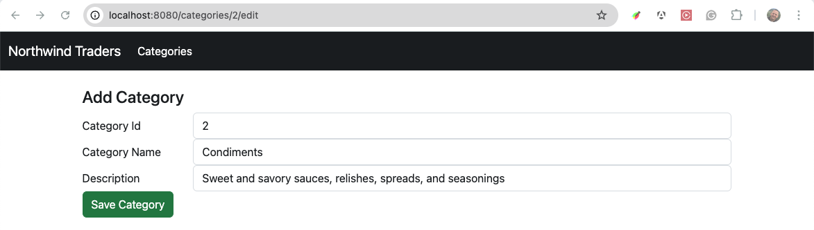
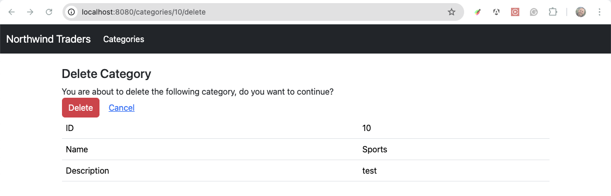
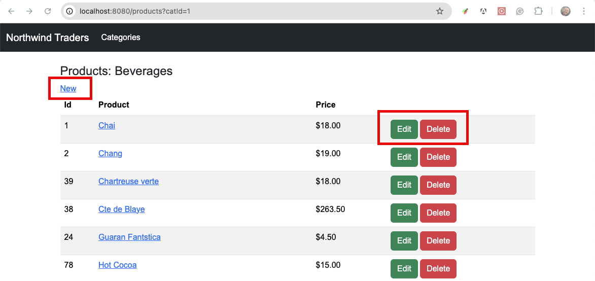
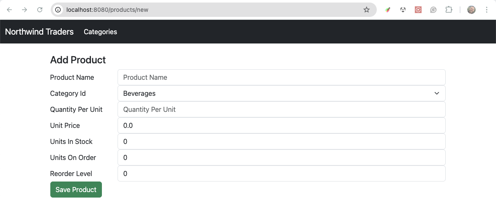
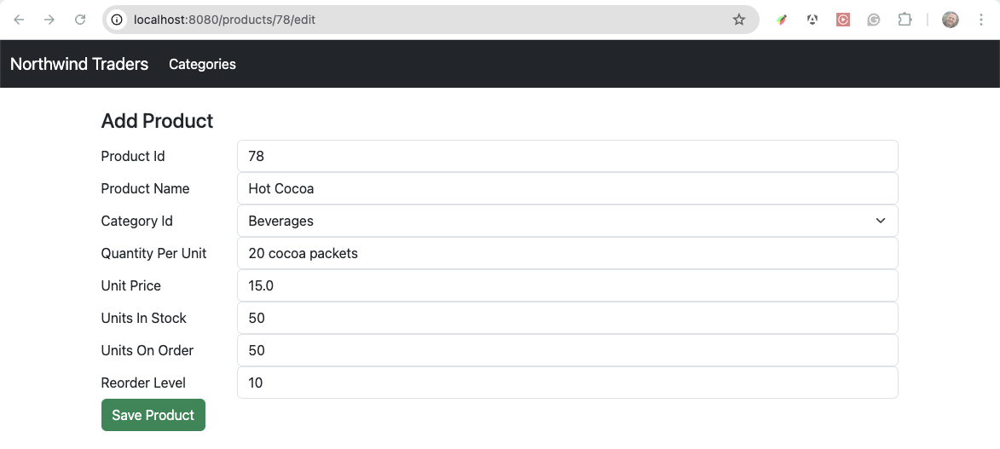
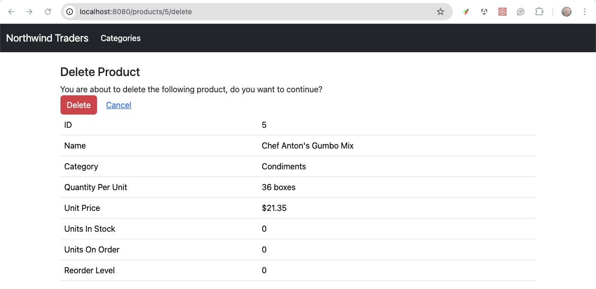
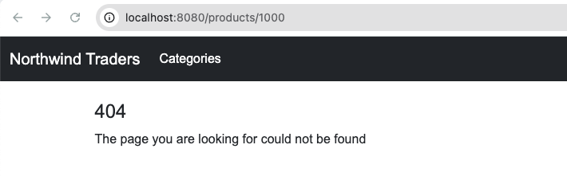

# Spring Boot with Thymeleaf Exercise - Part 2

In this chapter you learned how to INSERT, UPDATE and DELETE data
using Spring Boot Controllers.

In these exercise you will solidify these concepts by modifying your Spring 
controllers and using the Thymeleaf view engine to build your forms. 

## Learning objectives

After completing this exercise, you'll understand:

* How the MVC pattern is used for all CRUD operations
* How to respond to POST requests
* How to create add, edit and delete view templates
* How to modify data based on user input forms


## Evaluation criteria and functional requirements

* The project must compile (it cannot have any build errors).
* Your project must have an add category page
* Your project must have an edit category page
* Your project must have a delete category page
* **Optional** Your project should have an add product page
* **Optional** Your project should have an edit productg page
* **Optional** Your project should have a delete productg page

## Getting started

1. Continue working on the **Day 17** `exercises_mvc-web-appliclation` project.
2. Edit the `categories/index.html` view template to add links to `edit` and `delete`
   a category
   
3. Expand the `controllers` package and open the `CategoryController`.

##### Add Category

1. Add an `@GetMapping("categories/add")` method to handle the `/categories/add` path
    - This handler method is used to display the initial empty form for the user to fill out
    - Return `categories/add` as the name of the view to be processed
2. Add a new view template for to allow users to add a new category'
    - File name `categories/add_edit.html`
    - Create a form with the following attributes `<form action="#" th:object="${category}" method="post">`
    - Add input text elements to allow the user to enter category name and description
    - `<label th:for="*{categoryName}">Category Name</label>`
    - `<input type="text" th:field="*{categoryName}"></input>`
    
3. In the Categories Controller add a `@PostMapping("categories/add")` method to handle adding the new category
    - This is the handler that will be executed when the form is submitted
    - The method signature should be `addCategory(@ModelAttribute("category") Category category)`
    - Use the `CategoryDao` to save the category to the database
    - Redirect to the categories home page by returning the String `redirect:/categories`


##### Edit Category

1. In the `CategoriesController` add a `@GetMapping("/categories/{id}/edit")` handler method
    - Using the `CategoryDao` find the category by id and add the `category` to the Spring `model`
    - Return the name of the view that will display the edit form `categories/add-edit`
    - You will use the same view template as the Add action `categories/add-edit.html`
    
2. Add a `@PostMapping("/categories/{id}/edit")` handler method
    - Input parameters should be `editCategory(@ModelAttribute("category") Category category, @PathVariable int id)`
    - Use the `CategoryDao` to update the category information in the database
    - Redirect to the categories home page by returning the String `redirect:/categories`


##### Delete Category

1. In the `CategoriesController` add a `@GetMapping("/categories/{id}/delete")` handler method
    - Using the `CategoryDao` find the category by id and add the `category` to the Spring `model`
    - Return the name of the view that will display the edit form `categories/delete`
2. Create a new View template to display the category that is about to be deleted.
    - File name `categories/delete.html`
    - Display the Category name and inform the user that they are about to delete the category
    - Add a form to allow them to confirm the `delete` action.
    - The form should submit to the same page as confirmation of the delete action
    
2. Add a `@PostMapping("/categories/{id}/delete")` handler method
    - Input parameters should be `deleteCategory(@PathVariable int id)`
    - Use the `CategoryDao` to delete the category from the database
    - Redirect to the categories home page by returning the String `redirect:/categories`


## Optional / Challenge

Add functionality to the `ProductsController` to allow users to add, edit and delete products.

1. Add links to `add`, `edit`, and `delete` products in the product list page.
    
2. Create handler methods and view templates to Add a new product
    - You will need to use the `CategoryDao` to get a list of categories, so that you can populate
      a select list of categories to select in the Product Add form
    
3. Create handler methods and view templates to update product information
    
4. Create handler methods and view templates to delete a product
    
5. Add a `templates/404.html` view template.
    - Redirect to this page from any controller handler method if the category/product the 
      user selected could not be found
      


## Tips and hints

Thymeleaf syntax hints

```html
<!-- form 
    action - specifies the page/path that the form will be submitted to - # means it posts to the current browser URL
    method - specifies if the form will use POSt or GET
    th:object - specifies the object variable name that will be used for data binding
 -->
<form action="#" method="post" th:object="${category}">

    <!-- label - for links the label to the associated input element-->
    <label th:for="*{categoryName}">Category Name</label>

    <!-- input - field binds the form to property in the forms object -->
    <input type="text" th:field="*{categoryName}"></input>

</form>

```


